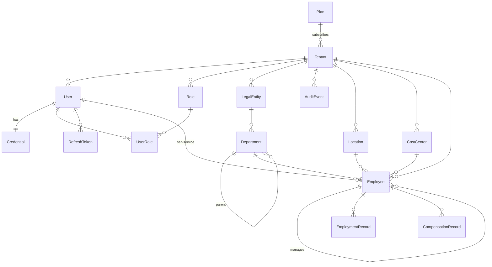

# Data model (identity, tenancy, org & employees)

Authoritative schema: [`packages/db/prisma/schema.prisma`](../packages/db/prisma/schema.prisma). This doc
explains the **shape and the tenancy/RLS rules**; the schema is the source of truth.

## Multi-tenancy

Strategy: **shared database, shared schema, mandatory `tenant_id`** on every tenant-owned row
(PLAN.md §8). Isolation is enforced by two independent layers:

1. **Application:** all tenant-scoped access goes through `forTenant` / `runInTenant`
   ([`packages/db/src/tenant.ts`](../packages/db/src/tenant.ts)), which set the
   `app.current_tenant_id` GUC per transaction.
2. **Database, Row-Level Security.** Every tenant-owned table has `ENABLE` + `FORCE ROW LEVEL
SECURITY` and a `tenant_isolation` policy (`USING`/`WITH CHECK` on `tenant_id =
current_setting('app.current_tenant_id')`). The app connects as the least-privilege **`payce_app`**
   role (not a superuser, not the owner, `NOBYPASSRLS`), so the policy genuinely applies; with no GUC
   set the query sees **zero rows** (fail closed). Migrations connect as the schema owner via Prisma
   `directUrl`.

> Why a separate role: a superuser or table owner **bypasses** RLS, so the app must never connect as
> one. This is verified by the isolation suite in `apps/api/test/tenant-isolation.int.test.ts`.

## Entities

### Platform plane (not tenant-scoped, no RLS)

| Model        | Purpose                                                           |
| ------------ | ----------------------------------------------------------------- |
| `Plan`       | Subscription plan catalog.                                        |
| `Tenant`     | A customer org. `slug` unique; `status` PENDING/ACTIVE/SUSPENDED. |
| `Permission` | Global permission-key catalog (seeded from `@payce/rbac`).        |

### Identity (tenant-scoped, RLS)

| Model               | Notes                                                                                      |
| ------------------- | ------------------------------------------------------------------------------------------ |
| `User` (`app_user`) | `@@unique([tenantId, email])`; status INVITED/ACTIVE/DISABLED.                             |
| `Credential`        | 1:1 with user; Argon2id `passwordHash`, optional TOTP `mfaSecret` + `mfaEnabled`.          |
| `Role`              | Per-tenant; `permissionKeys String[]` references the catalog; `isSystem` for seeded roles. |
| `UserRole`          | User↔Role with optional `scope` (JSON) for legal-entity / pay-group narrowing later.       |
| `RefreshToken`      | Rotating refresh tokens (sha-256 `tokenHash`, `family` for reuse detection).               |

### Org & employees (tenant-scoped, RLS)

| Model                | Notes                                                                                                                                                                               |
| -------------------- | ----------------------------------------------------------------------------------------------------------------------------------------------------------------------------------- |
| `LegalEntity`        | Legal employer; `@@unique([tenantId, name])`.                                                                                                                                       |
| `Department`         | Self-referential hierarchy (`parentId`); optional `legalEntityId`.                                                                                                                  |
| `Location`           | Work location; `@@unique([tenantId, name])`, `countryCode`, optional `city`/`timezone`.                                                                                             |
| `CostCenter`         | `@@unique([tenantId, code])`; optional `legalEntityId`.                                                                                                                             |
| `Employee`           | Core person record; `@@unique([tenantId, employeeNumber])`; optional 1:1 `userId` (MyHR self-service); `managerId` self-reference for the org tree; soft-deletable via `deletedAt`. |
| `EmploymentRecord`   | Effective-dated (`effectiveFrom`/`effectiveTo`) terms: `employmentType`, `jobTitle`.                                                                                                |
| `CompensationRecord` | Effective-dated pay: `amountMinor` (BigInt, integer minor units) + `currencyCode` + `frequency`.                                                                                    |

> `BankAccount` (encrypted) is deferred to Phase 3, where disbursement needs it and KMS envelope-encryption is wired.

### Audit (append-only, tenant-scoped)

`AuditEvent`: who/what/when/where + `before`/`after` JSON, `requestId`, `ip`. Written atomically inside
the same tenant transaction as the mutation it records.

## Conventions

- **PKs:** UUID v7 (`@default(uuid(7))`). **Audit columns:** `created_at/updated_at` everywhere,
  `created_by/updated_by` where an actor applies. **Timestamps:** UTC.
- **Money:** integer minor units (BigInt) + ISO currency code, never floats (see `CompensationRecord.amountMinor`).
- Column names are `snake_case` (via `@map`); Prisma models are `PascalCase`.
